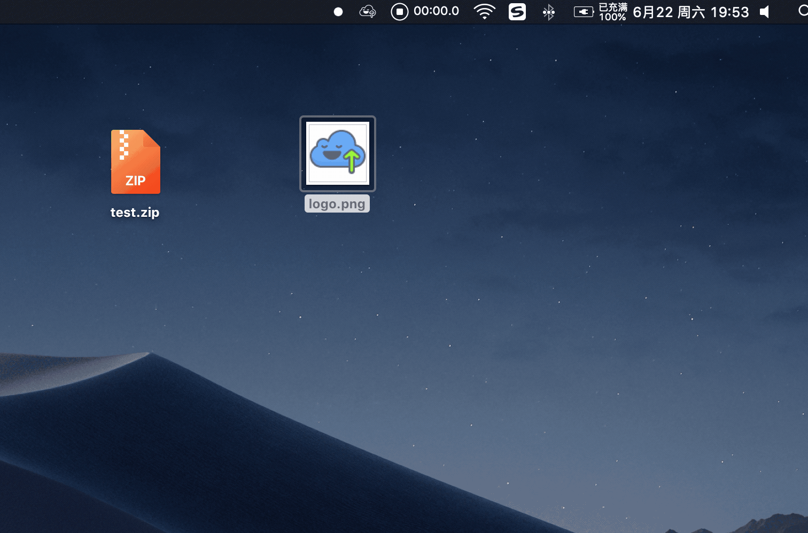
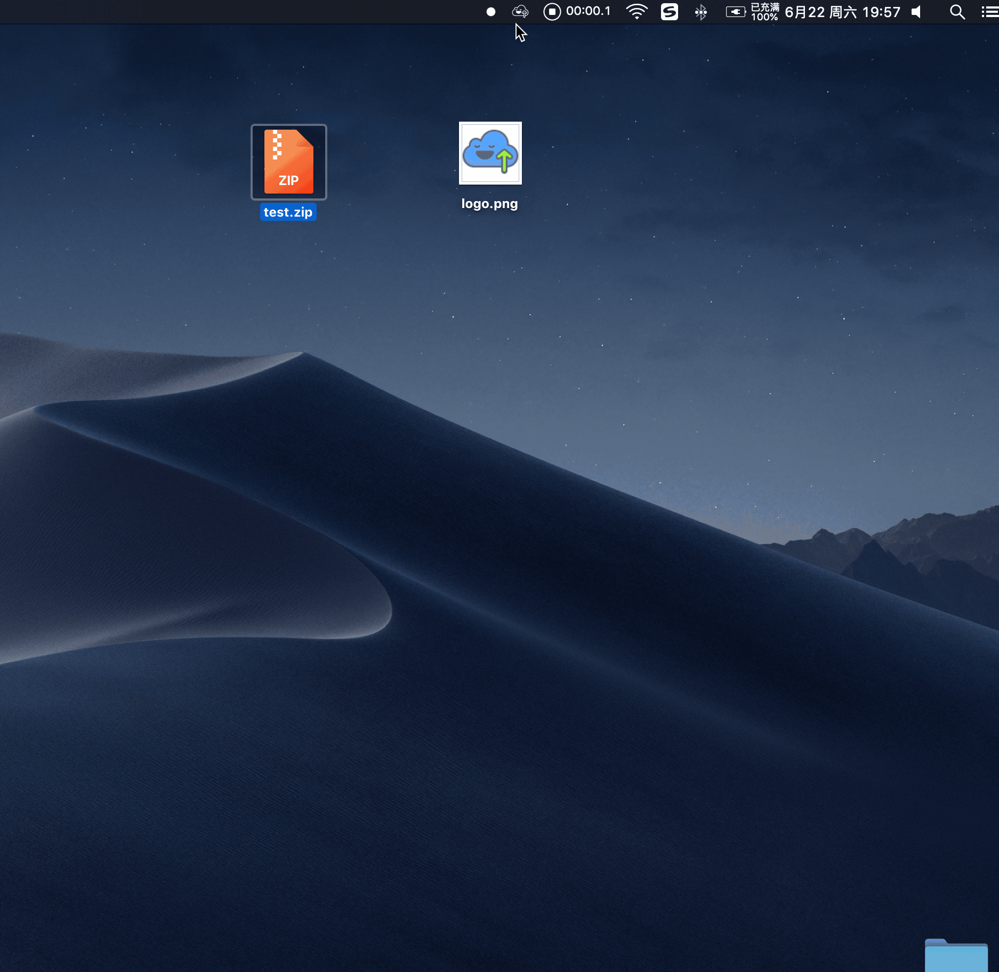
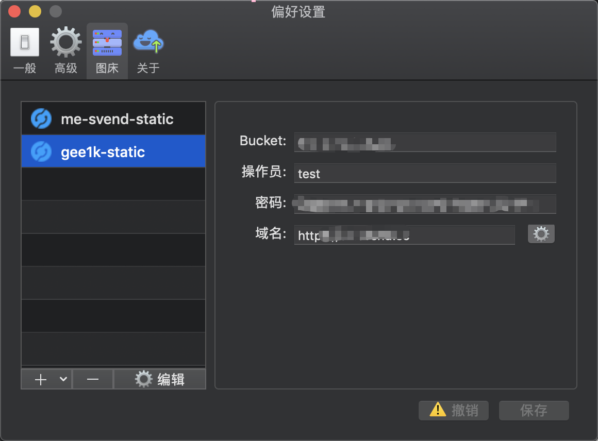
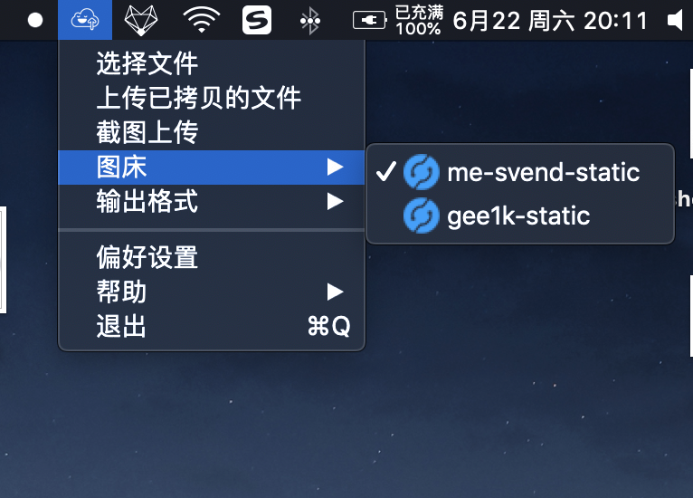
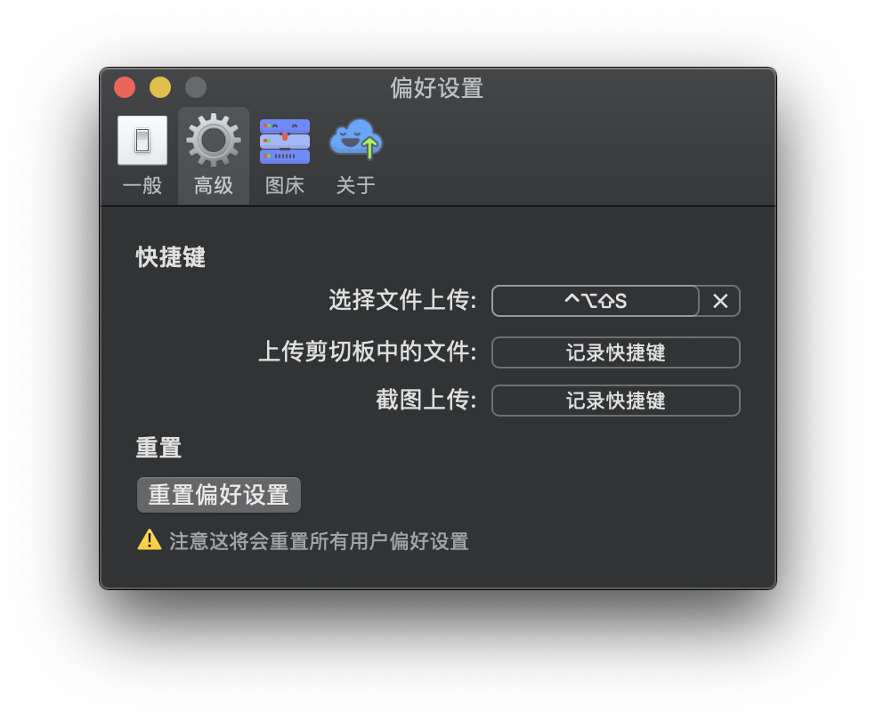
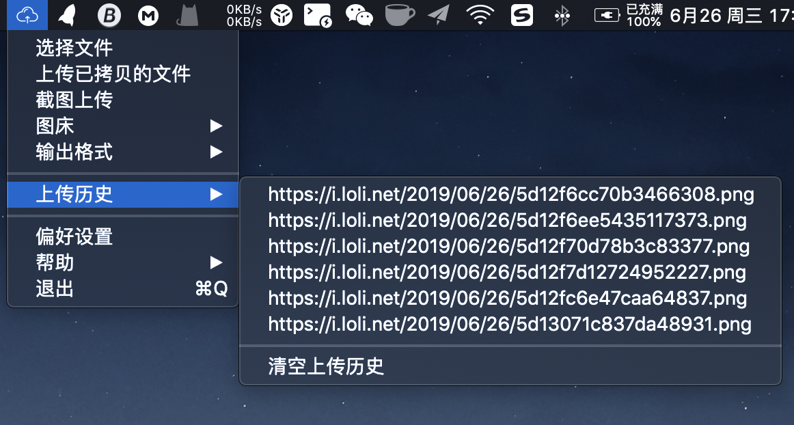

# ☁️ 简洁的 Mac 图床客户端 uPic

     

- [📑 简介](#-简介)
- [💡 特点](#-特点)
- [📤 上传方式](#-上传方式)
	- [🖥 选择文件上传](#-选择文件上传)
	- [⌨️ 复制文件上传](#-复制文件上传)
	- [🖱 拖拽文件上传](#-拖拽文件上传)
	- [📸 截图上传](#-截图上传)
- [📦 图床、对象存储](#-图床对象存储)
	- [⚙️ 配置图床](#-配置图床)
	- [🔦 选择图床](#-选择图床)
- [🧰 更多功能](#-更多功能)
	- [⌨︎ 全局快捷键](#-全局快捷键)
	- [🕦 上传历史](#-上传历史)
- [💌 联系我](#-联系我)
- [📝 使用手册](#-使用手册)
- [❤️ 赞助](#-赞助)

> 📌 公告：请悉知
>
>  [❗【重要提示】v0.6.0 版升级到 v0.6.1 时请手动从 release 下载最新覆盖安装](https://github.com/gee1k/uPic/issues/12)
>
> 给您带来的不便，很抱歉

## 📑 简介

> **uPic 是一款 Mac 端的图床(文件)上传客户端**
> 可将图片、各种文件上传到配置好的指定提供商的对象存储中。
> 然后快速获取可供互联网访问的文件 URL

## 💡 特点

无论是本地文件、或者屏幕截图都可自动上传，菜单栏显示实时上传进度。上传完成后文件链接自动复制到剪切板，让你无论是在写博客、灌水聊天都能快速插入图片。
连接格式可以是普通 URL、HTML 或者 Markdown，仍由你掌控。

## 📤 上传方式

为了满足你可能遇到的各种需求，uPic 提供了多种上传方式

- ✅ 选择文件上传
- ✅ 复制文件上传
- ✅ 拖拽文件上传
- ✅ 截图上传

#### 🖥 选择文件上传

#### ⌨️ 复制文件上传

#### 🖱 拖拽文件上传

#### 📸 截图上传

## 📦 图床、对象存储

- [smms](https://sm.ms/)
- [又拍云 USS](https://www.upyun.com/products/file-storage)
- [七牛云 KODO](https://www.qiniu.com/products/kodo)
- [阿里云 OSS](https://www.aliyun.com/product/oss/)
- [腾讯云 COS](https://cloud.tencent.com/product/cos)
- [自定义上传接口](https://blog.svend.cc/upic/tutorials/custom)
- ...

#### ⚙️ 配置图床

**在`偏好设置`中可配置图床。支持同一类型图床可配置多个实例**

#### 🔦 选择图床

**配置好的图床可以在菜单栏`图床`中看到，并选择您接下来要上传到的图床**

## 🧰 更多功能

**除了以上这些最基本的功能以外，uPic 还提供了一系列小功能让你使用起来更方便更顺心**

### ⌨︎ 全局快捷键

### 🕦 上传历史

### 📢 更多功能等待你发现

...

## 🚀 安装

- 下载安装包手动安装。下载地址：[https://github.com/gee1k/uPic/releases](https://github.com/gee1k/uPic/releases)
- [homebrew](https://brew.sh/) 安装：`brew cask install upic`   `注意：由于提交安装包到 brew 需要等待官方统一，所以版本更新不是很及时`

### ⬆️ 更新

- 1.手动下载更新：[https://github.com/gee1k/uPic/releases](https://github.com/gee1k/uPic/releases)
- 2.如果是通过 `homebrew` 安装的可使用`brew cask upgrade upic`升级

**无论哪种方式安装的都可以通过软件`菜单栏 - 帮助 - 检查更新` 来升级**

# 💌 联系我

- `Email`: svend.jin@gmail.com
- `微信`: `JSW5297` (请备注一下 uPic)
- `Telegram`: [gee1k](https://t.me/gee1k)
- `项目地址`: [Github](https://github.com/gee1k/uPic)

# 📝 使用手册

**编写中...敬请期待**

# ❤️ 赞助

如果你喜欢 uPic ，欢迎给我打赏

- 支付宝：

- 微信：

## License

[MIT](http://opensource.org/licenses/MIT)

Copyright (c) 2019 gee1k
