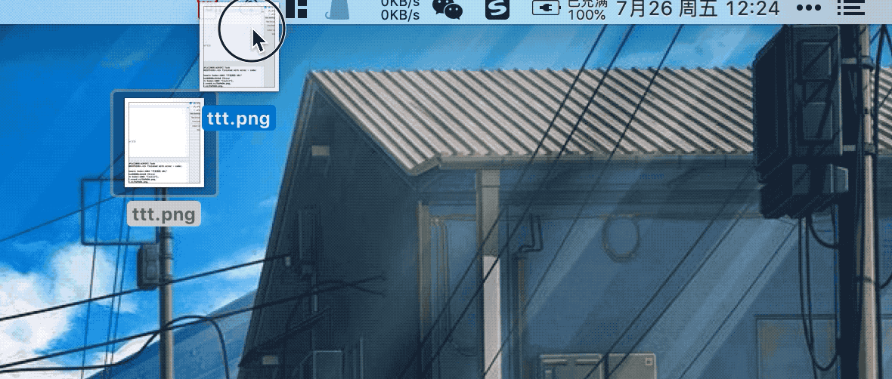
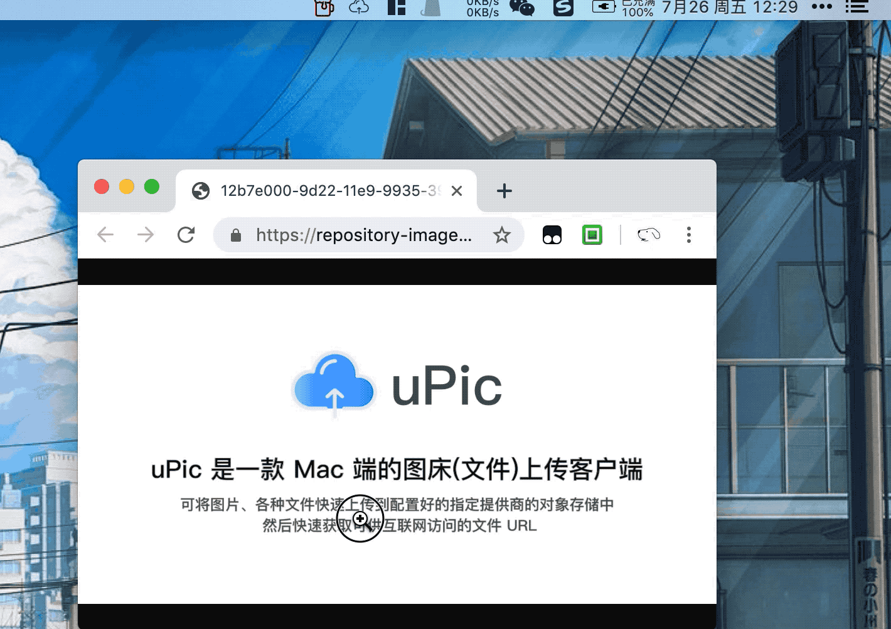
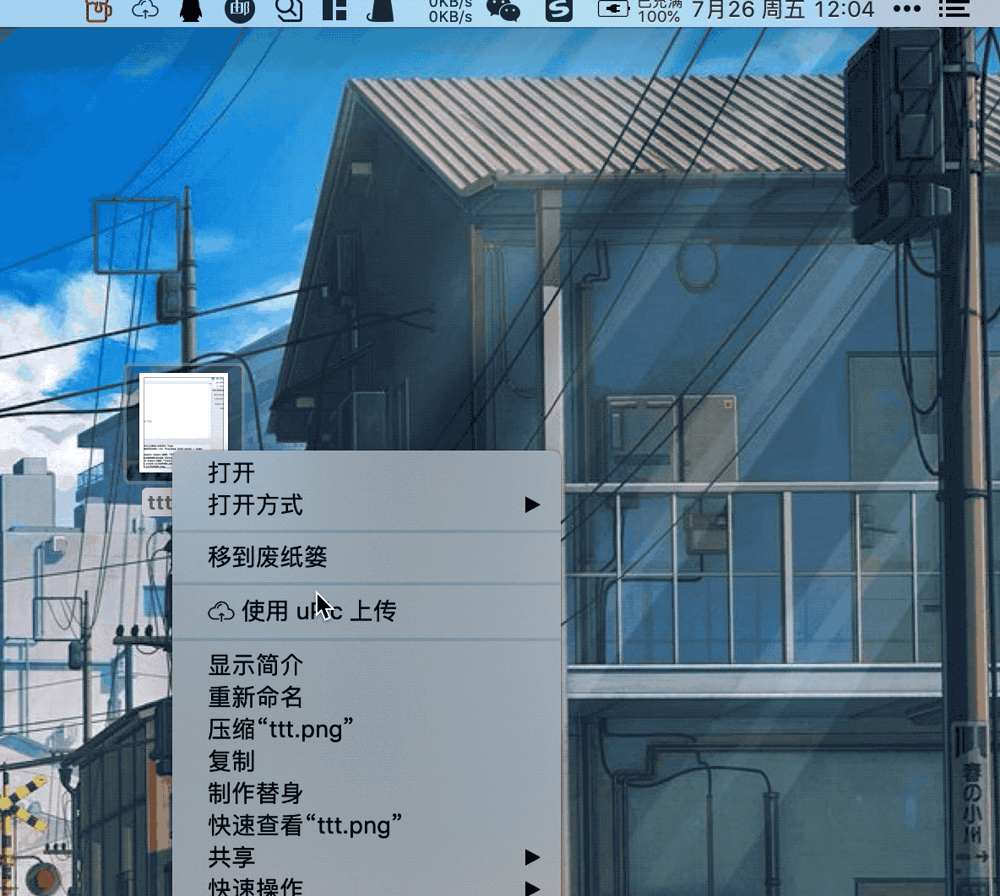

  

# ☁️ 简洁的 Mac 图床客户端 uPic

     

## 📑 简介

> **uPic(upload Picture) 是一款 Mac 端的图床(文件)上传客户端**
> 可将图片、各种文件上传到配置好的指定提供商的对象存储中。
> 然后快速获取可供互联网访问的文件 URL

## 💡 特点

无论是本地文件、或者屏幕截图都可自动上传，菜单栏显示实时上传进度。上传完成后文件链接自动复制到剪切板，让你无论是在写博客、灌水聊天都能快速插入图片。
连接格式可以是普通 URL、HTML 或者 Markdown，仍由你掌控。

## 🕹 使用方式

| 功能 | 描述 | 预览 |
| --- | --- | --- |
| **🖥 选择文件上传** | 从`Finder`选择文件上传 |  |
| **⌨️ 复制文件上传** | 上传已拷贝到剪切板的文件 |  |
| **🖱 拖拽本地文件上传** | 拖拽文件到状态栏上传 |  |
| **🖱 拖拽浏览器图片上传** | 从浏览器拖拽图片到状态栏上传 |  |
| **📸 截图上传** | 直接拉框截图上传 |  |
| **📂 Finder 中右键上传** | 右击文件上传 |  |

## 📦 支持图床、对象存储

- [smms](https://sm.ms/)
- [又拍云 USS](https://www.upyun.com/products/file-storage)
- [七牛云 KODO](https://www.qiniu.com/products/kodo)
- [阿里云 OSS](https://www.aliyun.com/product/oss/)
- [腾讯云 COS](https://cloud.tencent.com/product/cos)
- [微博](https://weibo.com/)
- [Github](https://github.com/settings/tokens)
- [Gitee](https://gitee.com/profile/personal_access_tokens)
- [自定义上传接口](https://blog.svend.cc/upic/tutorials/custom)
- ...

| 功能 | 描述 | 预览 |
| --- | --- | --- |
| **⚙️ 配置图床** | 在`偏好设置`中可配置图床。支持同一类型图床可配置多个实例 |  |
| **🔦 选择图床** | 配置好的图床可以在菜单栏`图床`中看到，并选择您接下来要上传到的图床 |  |

## 🧰 更多功能

**除了以上这些最基本的功能以外，uPic 还提供了一系列小功能让你使用起来更方便更顺心**

| 功能 |  | 预览 |
| --- | --- | --- |
| **⌨︎ 全局快捷键** | |  |
| **🕦 上传历史** | |  |
| **📢 更多功能等待你发现** | | ... |
...

## 🚀 安装

- 下载安装包手动安装。下载地址：[https://github.com/gee1k/uPic/releases](https://github.com/gee1k/uPic/releases)
- [homebrew](https://brew.sh/) 安装：`brew cask install upic`   `注意：由于提交安装包到 brew 需要等待官方合并，所以版本更新不是很及时`

### ⬆️ 更新

- 1.手动下载更新：[https://github.com/gee1k/uPic/releases](https://github.com/gee1k/uPic/releases)
- 2.如果是通过 `homebrew` 安装的可使用`brew cask upgrade upic`升级

**无论哪种方式安装的都可以通过软件`菜单栏 - 帮助 - 检查更新` 来升级**

# 💌 联系我

- `Email`: svend.jin@gmail.com
- `微信`: `JSW5297` (请备注一下 uPic)
- `Telegram`: [gee1k](https://t.me/gee1k)
- `项目地址`: [Github](https://github.com/gee1k/uPic)
- `uPic 产品交流群(Telegram)`:  [点击加入 TG 群](https://t.me/upic_host)
- `uPic 产品交流群(微信)`: 
	

# 📝 使用手册

- [uPic 图床配置教程 - 微博](https://blog.svend.cc/upic/tutorials/weibo)
- [uPic 图床配置教程 - 又拍云](https://blog.svend.cc/upic/tutorials/upyun_uss)
- [uPic 图床配置教程 - 七牛云](https://blog.svend.cc/upic/tutorials/qiniu_kodo)
- [uPic 图床配置教程 - 阿里云](https://blog.svend.cc/upic/tutorials/aliyun_oss)
- [uPic 图床配置教程 - 腾讯云](https://blog.svend.cc/upic/tutorials/tencent_cos)
- [uPic 图床配置教程 - Github](https://blog.svend.cc/upic/tutorials/github)
- [uPic 图床配置教程 - 码云(Gitee)](https://blog.svend.cc/upic/tutorials/gitee)
- [uPic 图床配置教程 - 自定义上传](https://blog.svend.cc/upic/tutorials/custom)

# ❤️ 赞助

如果你喜欢 uPic ，欢迎给我打赏

| **支付宝** | **微信** |
| --- | --- |
|  |  |

## License

[MIT](http://opensource.org/licenses/MIT)

Copyright (c) 2019 gee1k

